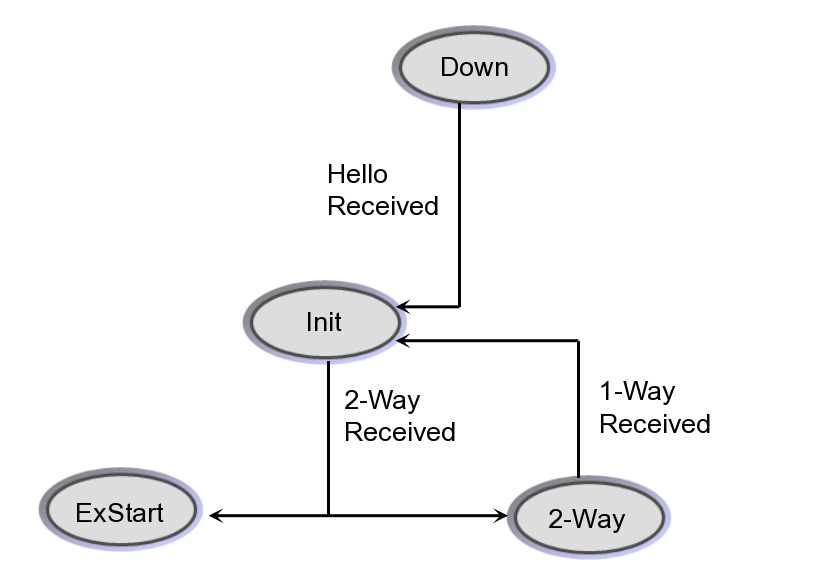
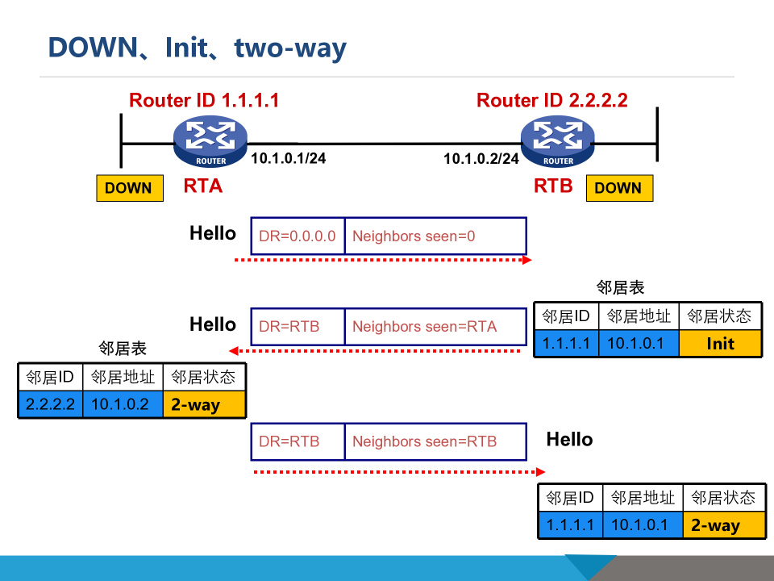
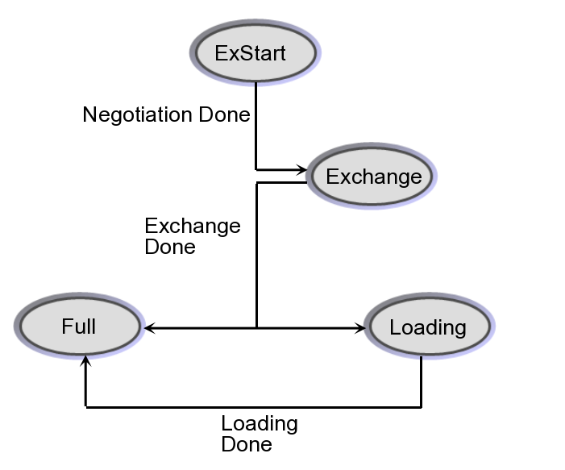
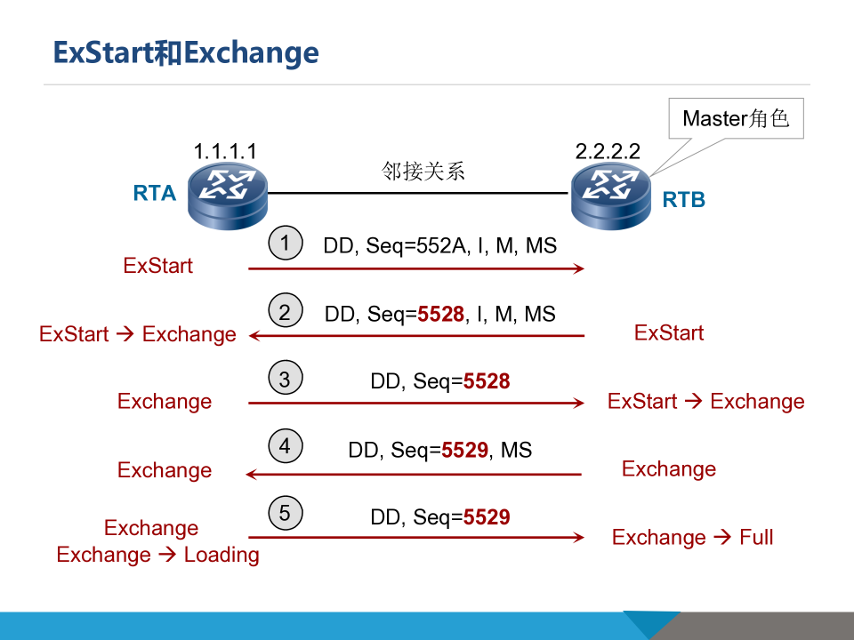
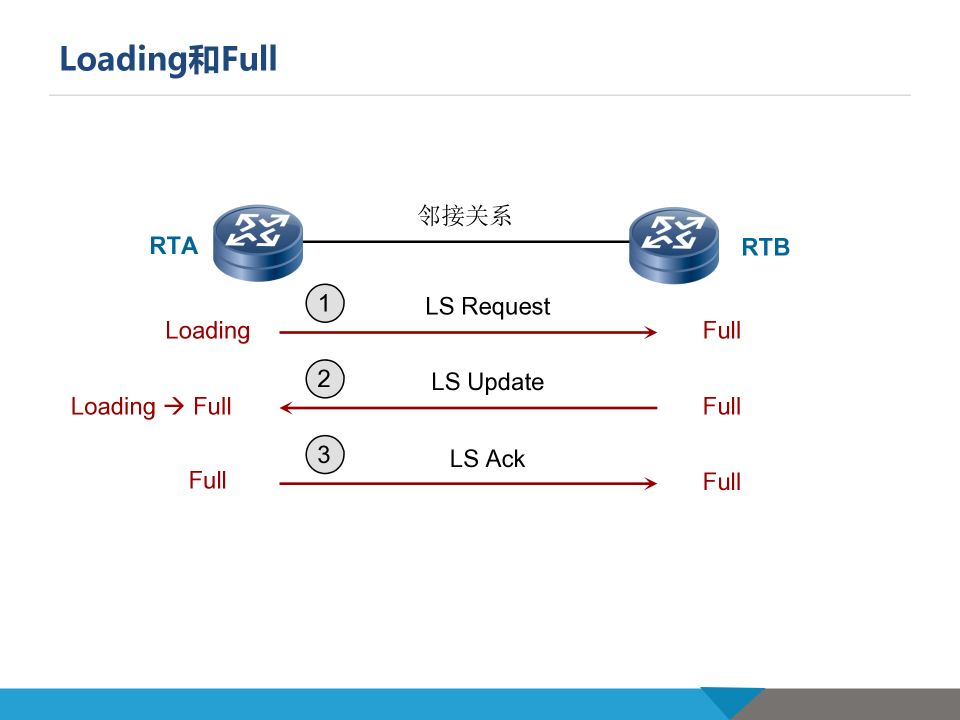
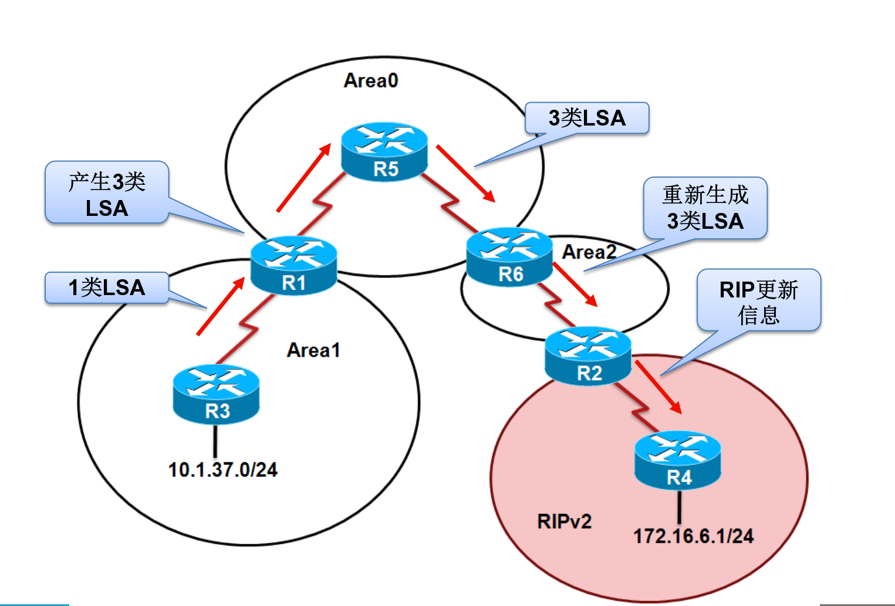

# 路由

## OSPF

### OSPF 特点

- OSPF 英文全称 Open Shortest Path First (开放式最短路径优先)
- OSPF 是 IETF 开发的一种链路状态路由协议，使用基于带宽的度量值。
- OSPF 采用 SPF 算法计算路由，从算法上保证了无路由环路。
- OSPF 通过邻居关系维护路由，避免了定期更新对带宽的消耗。
- OSPF 路由更新效率高，网络收敛快，适用于大中型网络。
- OSPF 报文封装于 IP，协议号 89，组播地址 224.0.0.5 与 224.0.0.6。

### OSPF 的工作流程

1. 建立邻居：通过 Hello 报文探测和发现邻居，形成 OSPF 邻居表
2. 发起路由：描述直连网段及直连拓扑，发起 LSA, 存放到自己的 LSDB
3. 传播路由：LSA 洪泛，区域内路由器的 LSDB 达到一致
4. 计算路由：以自己的 LSA 1 为根进行 SPF 计算，算出路由

### OSPF 基本概念

#### RouterID（RID）

- OSPF 协议的必备元素
- 32bit 无符号整数，在一个 AS 中唯一标识一台路由器
- 可以手工配置，也可自动生成
- 自动生成规则为选择所有端口中所配置的最大的 IP 地址作为 RID（选主机位多且主机号大的）

#### LS

链路状态（LS）：路由器周边链路的状态

- 直连网段状态：通过接口网段和接口状态感知，描述格式为（网段，掩码，接口开销）
- 直连拓扑状态：通过 OSPF 邻居和邻居状态感知，描述格式为（邻居 RID，连接接口，接口开销)
- 接口开销：OSPF 参考带宽/接口带宽；参考带宽默认为 100Mbps, Loopback 接口开销默认为 1

#### LSA

LSA  Link State Advertisement 链路状态通告

- LSA 1：路由器链路状态通告
- LSA 2： 传送网络链路状态通告

#### LSDB

链路状态数据库

- 每台 OSPF 路由器都有一个 LSDB,，用于存储 LSA
- 同一区域内的 OSPF 路由器的 LSDB 一致：LSA 封装在 LSU（Link State Update）报文中，在区域内洪泛，最终达到区域内 LSDB 一致；LSA 在洪泛过程中内容保持不变。

#### OSPF 网络类型

- Broadcast 广播多路访问：以太网接口
- P2P（Point-to-Point，点到点）：PPP HDLC 接口

#### OSPF 报文类型与封装

|         OSPF 报文类型          |                      作用                      |
| :---------------------------: | :--------------------------------------------: |
|             Hello             |               建立并维护邻居关系               |
|  Database Description（DD）   |       数据库内容的汇总（仅包含 LSA 头部）        |
|  Link State  Request（LSR）   | 请求自己没有的或者比自己更新的链路状态详细信息 |
|   Link State Update（LSU）    |        链路状态更新信息(LSA 头部和内容)         |
| Link State Acknowledge(LSAck) |                  对 LSU 的确认                   |

OSPF 报文直接封装在 IP 报文中，协议号为 89

#### OSPF 报文的目的地址

|                | Hello     | Database Description | Link State Request | Link State Update    | Link State Ack       |
| -------------- | --------- | -------------------- | ------------------ | -------------------- | -------------------- |
| Point-to-Point | 224.0.0.5 | 224.0.0.5            | 224.0.0.5          | 224.0.0.5            | 224.0.0.5            |
| Broadcast      | 224.0.0.5 | 单播                 | 单播               | 224.0.0.5 或 224.0.0.6 | 224.0.0.5 或 224.0.0.6 |

#### 邻居关系

- 邻居之间通过交换 Hello 报文，确认邻居是否工作正常
- 如果在一定的时间间隔内，收不到邻居发来的 Hello 报文，就认为邻居已经失效，从邻居中删除

#### DR/BDR 的选举（广播多路访问）

DR: Designate router，指定路由器

BDR：Backup Disignate router，备用指定路由器

1. 首先比较 Hello 报文中携带的优先级，最高的被选举为 DR，次高的被选举为 BDR；优先级为 0 的不参与选举
2. 优先级一致的情况下，比较 RouterID，越大越优先
3. 保持稳定原则：当已经选举完毕时，就算以太具有更高优先级的路由器变为有效，也不回替换该网段中已经选举的 DR/BDR 成为新的 DR/BDR。

DR 失效时，BDR 立即成为 DR，RouterID 最大的立即成为 BDR

最大的 IP 地址自动成为 RouterID

当有新的 LSA 生成或收到时，这条 LSA 应当被洪泛

#### 邻居状态变换

- 邻居关系  

- 邻接关系   

### LSA 老化

最大老化时间 1h

老化时间达到 30m 时，发起路由器随机等待后重新发起该 LSA并洪泛，只序列号加一，其他不变

收到 LSA 时比较序列号，若收到的 LSA 序列号大则替换掉本地 LSA, 否则忽略

### OSPF 区域号

AreaID：32 位 数字或者ip表示

外部防环：与骨干区域 0 相连

#### 多区域划分

单区域的问题：

- LSDB 庞大、占用内存大、SPF 占用开销大

区域分类：

- 骨干区域：Area0, 必须连续，不能分割
- 非骨干区域：必须与 Area0 相连，非骨干区域不能交换路由信息。
- 特殊区域：某些具备特殊性质的区域，如 Stub、NSSA 区域

LSDB：

- 每个区域都有自己独立的LSDB,SPF单独计算
- LSA洪泛和LSDB只在区域内进行

ABR:

- Area Border Router 区域边界路由
- OSPF只知道本区域内的信息，不知道其他区域的拓扑结构。其他区域路由信息依靠本区域的ABR来表述
- ABR先计算本区域的LSA 1、LSA 2，再向其他区域发起LSA 3。并为Area 0重新发起LSA 3。

ASBR：

- Autonomous System Boundary Router 自治系统边界路由
- OSPF通过ASBR来描述外部路由的可达性
- ASBR为外部路由发起LSA 5，在整个OSPFo路由中洪泛

#### 多区域中的LSA类型

| 级别 |           名称            |  发起路由  |        洪泛范围        |                作用                |
| :--: | :-----------------------: | :--------: | :--------------------: | :--------------------------------: |
|  1   |   Router LSA(路由器LSA)   | OSPF路由器 |         区域内         |      描述路由器的直连拓扑信息      |
|  2   |   Network LSA(网络LSA)    |     DR     |         区域内         | 描述多路访问网络DR邻接的一组路由器 |
|  3   |   Summary LSA(汇总LSA)    |    ABR     |         区域内         |        描述区域间的路由信息        |
|  4   |         ASBR LSA          |    ABR     |         区域内         |       描述区域间ASBR的可达性       |
|  5   | External LSA(外部路由LSA) |    ASBR    | OSPF路由域(除特殊区域) |          描述OSPF外部路由          |
|  7   |         NSSA LSA          | NSSA ASBR  |         区域内         |     描述NSSA区域的OSPF外部路由     |

### 开销类型

#### 类型 1

开销=LSA携带开销+到始发ASBR的开销

#### 类型 2

开销=LSA携带开销

### 选路原则

类型优先级：

1. 区域内路由
2. 区域间路由
3. 第一类外部路由
4. 第二类外部路由

在相同类型下，优先选择路由开销较小的路由。

### 路由汇总

ABR或者ASBR将具有相同前缀的路由信息聚合后发布到其他区域

- 减少LSA 3、LSA 5的数目，减少路由信息
- 减小路由表规模
- 提高路由器运算速度
- 

### 特殊区域

#### Stub 区域（末梢区域）

- 不需要了解外部路由信息
- 不允许 AS 外部 LSA 通告在其内部洪泛
- 不能配置虚链路，也不允许虚链路穿过
- 区域内路由器不能是 ASBR
- 可以有多台 ABR, 但实际上最好有一台

#### 完全 Stub 区域

- 不仅阻塞外部 LSA，而且阻塞所有汇总 LSA, 除了通告缺省路由的 LSA
- LSDB 更小	

#### NSSA

- 仅支持 RIP 的末梢网络路由器与 ABR 相连，ABR 既运行 OSPF 又运行 RIP
- 连接到非纯末梢区域
- 允许外部路由通告到 OSPF AS 中，而同时保留自主系统的区域部分的末梢区域特征
- Type7 LSA：NSSA 外部系统 LSA

#### 完全 NSSA

- 使用缺省路由到达外部的所有目的地址

#### 特殊区域总结

| 区域类型 |             命  令              |     类 型      | 发起路由器 |        洪泛范围        |
| :------: | :-----------------------------: | :------------: | :--------: | :--------------------: |
| 标准区域 |  default-information originate  | LSA 5(OE1/OE2) | ASBR 手动  | OSPF路由域(除特殊区域) |
|   Stub   |           area x stub           |   LSA 3(OIA)   | ABR  自动  |         区域内         |
| 完全Stub |     area x stub no-summary      |   LSA 3(OIA)   | ABR  自动  |         区域内         |
|   NSSA   | area x nssa default-information | LSA 7(ON1/ON2) | ASBR 手动  |         区域内         |
| 完全NSSA |     area x nssa no-summary      |   LSA 3(OIA)   | ABR  自动  |         区域内         |

# VLAN

基于端口/协议/mac 地址

端口类型使用最多

## 802.1Q 帧

从 802.3 到 802.1Q 帧

Vlan 带有 id 在交换机之间流通

VLAN 号范围 0-4095

### Trunk 类端口

- 一般用于交换机之间的连接
- 只有缺省 Vlan 的以太网帧不带标签，默认缺省 id = 1, 可改
- 缺省 vlan 会导致相同 lan 不能通讯
- PVID：某一个
- VID：某一个、多个、所有

### Access 链路类型端口

- 只允许缺省 Vlan 通过，仅接受和发送一个 Vlan 的数据帧

- 一般用于连接用户设备

- 接入层设备，如 AC 等

- PVID等于VID

  

### Hybrid 类端口

- 允许多个 Vlan 标签不带标签

## 以太网交换机的工作原理

广播包目标 mac 地址为全 F

冲突域：有可能发送电信号冲突

广播域

- 广播包到达的最大范围
- 路由器或三层交换机的三层接口处于独立的广播域中，终端主机发出的广播帧在三层接口被终止（无法穿越路由器）
- 定向广播包可以穿过，因为目的地址为网段

交换式以太网：交换机的每个端口处于独立的冲突域中，终端主机独占端口带宽。

### mac 地址表 学习过程

1. 基于源 mac 地址学习：把接受到的帧中的源地址与相应的端口关联起来
2. 基于目的 mac 地址查表转发
3. 如地址表中有，则转发至相应端口；如没有则广播
4. 广播、~~组播~~、和未知单播从接受端口之外的端口发送出去（即广播）

### vlan 拓展技术

路由器的每个端口都需要不同的网段

- Private VLAN 技术: 每个 Vlan 配置不同的网段，相当于路由器

- Super Vlan: 
  - sub vlan 

### 生成树协议 STP

环路的影响：mac 地址表“震荡”，不断删除上一条 mac 地址学习记录

STP 生成树协议：

- 通过阻断冗余链路来消除桥接网络中可能存在的路径回环
- 当前路径发生故障时，激活冗余备份链路，恢复网络连通性

生成树：在局域网中消除数据链路层物理环路的协议，在桥之间交换 BPDU（）计算生成树的过程

BPDU：

- 包含以下重要信息
  - 根桥 ID（优先级）
  - 根路径开销
  - 指定桥 ID
  - 指定端口 ID
- 各台设备的各个端口在初始时生成以自己为根桥的配置消息，向外发送自己的配置消息
- 收到 RootID 优先的，以收到为根，并发送出去
- 网络收敛后，根桥向外发送 BPDU, 其他对其进行转发

端口角色的确定：

- 根桥上的所有端口为指定端口 DP（Designated Port）
- 选举根路径开销最小的端口（RootPathCost）为根端口（Root Port）
- 每个物理段选出根

收敛速度：

- 直接收敛 30s
- 间接收敛 50s

确定端口角色的标准:

- 根端口：网桥上到根桥“最近”的端口

默认优先级：32768

临时环路：

TCN BPDU：网络拓扑状态发生改变，且该网桥至少包含一个指定端口时，会发送 TCN BPDU 包；

TCA

### 快速生成树协议 RSTP

RST BPDU 发送周期为 2s（一个 HelloTime），老化时间为三个 HelloTime 时长

阻塞端口立即对收到的低优先级 RST BPDU 做出回应

快速收敛机制：

- 边缘端口机制
- 根端口快速切换机制
- 指定端口快速切换机制

边缘端口：

- 网桥上直接和终端相连的端口，不参与生成树计算
- 可直接进入转发状态，无时延、不改变拓扑
- 收到 BPDU 后转为非边缘端口

指定端口快速切换：

- **P/A 机制**：握手必须在点到点链路进行
- 与相连网桥进行一次握手
- 协商前提为点到点链路(一对一)

### MSTP

STP/MSTP 的局限:

- 所有 Vlan 共享一棵生成树
- 无法实现不同 Vlan 在多条 Trunk 链路上的负载分担
  - 二层链路负载均衡
- 次优二层路径

MSTP 多生成树协议：

- 802.1s

MST 域：

- CST：外部生成树
- IST：内部生成树
- CIST：内部-外部生成树
- 域根
- 总根：域根通过 CST 选出总根

Master 端口：IST 跟桥在 CIST 上的根端口

超级 P/A 机制：

# 安全设备-防火墙

公网边界只能放路由器不能放交换机：交换机不支持 NAT

防火墙有交换机、路由器的功能

设备价格贵

防火墙：一种放置于本地网络和外部网络间的安全设备

## 防火墙技术的演进

传统防火墙分类：

- 包过滤防火墙：根据配置的Access Control List，ACL 访问控制列表允许一些数据包，而阻塞其他数据包；通过**五元组**（源ip，目的ip，源端口，目的端口，协议）分辨，匹配通过的放行，失败可能丢弃可能不丢弃；检测不到应用层
- 应用代理防火墙：在应用层进行简单检测，比包过滤防火墙具有更高的性能和安全性
- 状态检测防火墙：成功建立连接后记录状态并实时更新，但不能防御钓鱼类安全问题

