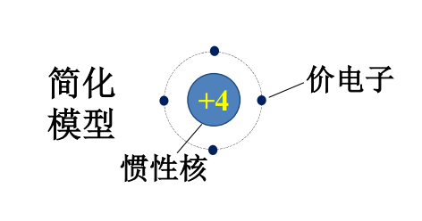
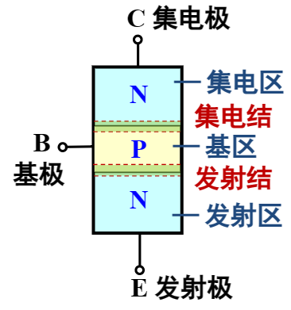
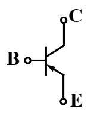

# 第五章 半导体器件基础与二极管电路
- 传感器：将非电信号转换为电信号  
## **5.1.1 PN结及其单向导电性**
- 半导体：导电能力介于导体和绝缘体之间的物质  
    - 例如*硅、锗、砷化镓* 等材料  
    - 具有独特的*光敏* 、*热敏* 和*掺杂特性*
### **一、本征半导体**
- **定义**：纯净、**不含杂质**、晶体结构完整的半导体称为本征半导体。 
    - 硅/锗原子结构的简化模型：  
  
    

    - 硅/锗的共价键结构：  
  
    

- **特性**
    - 本征激发：在光和热的作用下，本征半导体中产生电子-空穴对的现象。
    - 自由电子：脱离出共价键的电子。
    - 价电子：处于共价键中的电子。
        - 价电子移动形成电子电流。
    - 空穴：共价键中电子脱离后留下的空位。
        - 空穴移动形成空穴电流。
        - 空穴移动产生的电流实际上是价电子移动产生的电流。
    - **载流子**：能够导电的带电粒子，在半导体中有自由电子和空穴。
    - 复合：自由电子与空穴相遇，填补了空位，视为电子和空穴都消失
### **二、杂质半导体**
- 多数载流子，简称多子
- 少数载流子，简称少子
#### **1. N型半导体**  
  - 杂质：+5价元素，如磷
  - *电子* 为多子
  - *空穴* 为少子
   载流子数≈电子数
  - 简化模型  

#### 2. **P型半导体**
  - 杂质：+3价元素，如硼
  - *空穴* 为多子
  - *电子* 为少子
  - 载流子数≈空穴数
  - 简化模型  
    

### **三、PN结**
- 扩散运动：由于浓度差异而形成的定向移动，主要是多子扩散
- 漂移运动：由于电场作用而形成的定向移动，主要是少子漂移
#### **1. 形成**  
- 载流子的*浓度差* 引起多子的*扩散*，两种载流子在交界面*复合* ，使得交界面处只剩下杂质离子，形成了空间电荷区，即PN结，又称耗尽区
- 在空间电荷区中，由杂质离子产生的*内电场* 的场强方向由N区指向P区，该场强会抑制扩散作用，加强漂移作用，最终扩散和漂移达到动态平衡
#### **2. 单向导电性**
  - 正向偏置，简称正偏  
      - P区接正极，N区接负极
      - 内外电场反向
      - 外电场使多子向PN结移动中和部分离子，使空间电荷区变窄
         扩散运动加强形成正向电流 I = I~多子~- I~少子~≈ I~多子~
      - *内电场减弱→空间电荷区变窄→扩散电流 I 变大→导通*
  - 反向偏置，简称反偏
      - N区接正极，p区接负极
      - 内外电场同向
      - 外电场使多子背离PN结移动，空间电荷区变宽
      - 漂移运动加强形成反向电流 I~R~= I~少子~≈ 0
      - *内电场加强→空间电荷区变宽→ 少子漂移电流 I~R~≈ 0→ 截止*
  - 总结  
      - 正偏导通，呈小电阻，电流较大
      - 反向截止，电阻很大，电流近似为零  
## **5.1.2 二极管的结构、伏安特性及参数**  
- 电路符号  
      
### **一、结构**
- 点接触型  
    
    - 多为锗管，PN结面积小，不能通过大电流
    - PN结两侧积累的正负电荷少，相当于C比较小的电容，即结电容小，能通过高频交流电
- 面接触型  
    
    - 多为硅管，PN结面积大，能通过大电流，一般用于整流
    - PN结两侧积累的正负电荷少，相当于C比较的大的电容，即结电容大，只能通过低频的交流电
### **二、伏安特性**  
二极管是非线性元件。
- 图例  
  
      

#### **1. 正向特性**  
- 死区：当外加正向电压很低时，由于外电场还不能克服PN结内电场对多数载流子扩散运动的阻力，故正向电流很小几乎为零。    
    | 材料  | 死区电压U~th~ |
    | :---: | :-----------: |
    |  硅   |    约0.5V     |
    |  锗   |    约0.2V     |
    
      

- 正向电压/导通电压/管压降：当外加正向电压超过死区电压时正向电流迅速增长，二极管进入 ***正向导通区*** ,电压再继续增加时，电流迅速增大，而二极管端电压却几乎不变，此时二极管端电压称为 ***正向电压*** 。  

    | 材料  |      正向电压       |
    | :---: | :-----------------: |
    |  硅   | 0.6~0.7V **(0.7V)** |
    |  锗   | 0.1~0.3V **(0.3V)** |

    - 硅稳定性好,受温度影响小  
    

#### **2. 反向特性**  
- 反向饱和电流：在二极管两端加反向电压时，将有很小的、由少子漂移运动形成的反向饱和电流 (I~SS~) 通过二极管。
    - 随温度的上升增长很快
    - 在反向电压不超过某一范围时，反向电流的大小基本恒定  
    
    | 材料  | 反向饱和电流 |
    | :---: | :----------: |
    |  硅   |   1μA一下    |
    |  锗   |    几十μA    |

    

#### **3. 电流方程**  
- $\mathbf{i_D=I_{SS}(e^\frac{u_D}{U_T}-1)}$
- 温度电压当量U~T~= $\mathbf{\frac{kT}{q}}$
    - 常温t=27℃,U~T~=26mV
- 正向偏置： $i_D≈I_{SS}e^\frac{u_D}{U_T}$
- 反向偏置： $i_D≈I_{SS}$
- 温度上升→电压不变时电流增大→正向特性曲线左移
- 温度上升→反向饱和电流增加→反向特性曲线下移
- 温度影响电流的实质是加快了载流子的运动,反向特性受温度影响更大  

#### **4. 击穿特性**
- 反向击穿：外加反向电压超过**反向击穿电压**U~BR~时，反向电流突然增大，二极管失去单向导电性，进入**反向击穿区**。
    - 电击穿(可逆)
        - 雪崩击穿：掺杂浓度低,空间电荷区宽;反向电压大时,载流子获得大动能撞击价电子,产生了更多的自由电子-空穴对
        - 齐纳击穿：掺杂浓度高,空间电荷区窄,不大的反向电压就能拉出价电子形成载流子
    - 热击穿
        - 电流过大或温度过高,性能不能恢复

    
    
### **三、二极管的主要参数**
- 最大整流电流I~FM~
    - 二极管长期使用时，允许流过的最大正向平均电流。
- 反向峰值电压U~RWM~
    - 是保证二极管不被击穿而规定的最大反向工作电压，一般是UBR的一半或三分之二。
- 反向电流I~R~
    - 指二极管外加规定工作电压时的反向电流。
- 最高工作频率f~M~
    - 决定于PN结结电容的大小，超过时单向导电性能变得较差。
## **5.1.3二极管电路模型及电路分析**
### **一、二极管的电路模型**
- 将指数模型$\mathbf{i_D=I_{SS}(e^\frac{u_D}{U_T}-1)}$分段线性化，得到二极管伏安特性的等效模型。
#### **1. 理想模型**
  - 正向：管压降为0，电阻为0
  - 反向：电阻为无穷大，电流为0  
  

#### **2. 恒压降模型**
   - u~D~>U~D~：二极管导通,电阻为0
   - u~D~<U~D~：二极管截止,电流为0  
    

#### **3. 折线模型**  
  

### **二、二极管的电路分析**  
- 先定性后定量
- 定性分析；判断二极管的工作状态（导通/截止）
- 一般分析方法和步骤
  - 定性分析
    1. 将二极管断开
    2. 分析二极管阴阳两极接入点的点位大小或表达式
    3. 根据所选择的电路模型确定二极管的状态
  - 定量分析
     - 由二极管的状态求解输出电压或电流
## **5.1.4 稳压二极管**
### **一、特性和符号**
- 稳压二极管一般为硅材料面接触型
- 符号  
    
- 伏安特性  
    
### **二、主要参数**
1. 稳定电压U~Z~：稳压管正常工作（反向击穿）时，稳压管两端的电压。
2. 稳定电流I~Z~(I~Zmin~ ~I ~Zmax~)：稳压管正常工作时的参考电流。
3. 最大允许耗散功率P~ZM~：稳压管不发生热击穿的最大功率损耗
4. 动态电阻r~Z~：r~Z~=$\frac{ΔU_Z}{ΔI_Z}$，越小稳压效果越好。
5. 温度系数α~Z~：反应稳压电压值受温度影响的参数。
### **三、应用电路分析**
- 稳压管的动态稳压分析  
  
    - 若U~I~波动，R~L~不变：
      - U~I~升高，于是U~O~(U~Z~)升高，导致I~Z~增大，I~R~也增大，U~R~就会升高，导致了U~O~下降
    - 若R~L~减小，U~I~不变：
      - R~L~减小造成U~O~(U~Z~)降低，于是I~Z~减小，I~R~也减小，U~R~就会降低，导致了U~O~升高
- 多个稳压管的串并联分析
  - 两稳压管同向串联且都截止时，输出电压为两稳压值之和
  - 两稳压管异向串联且一个导通一个截止时，输出电压为两稳压值之差
  - 两稳压管同向并联截止时，输出电压为两稳压值中较小的一个
  - 两稳压管异向异向并联且一个导通一个截止时，输出电压为导通电压0.7V
## **5.2~5.4 常见的二极管应用电路**
### **1. 半波整流电路**
- 电路图  
  

- 输出波形  

- 输出电压平均值  
  - $\mathbf{U_o=\frac{1}{2π}\int_{0}^{π}\sqrt{2}U_2sin(ωt)d(ωt)=\frac{\sqrt{2}}{π}U_2≈0.45U_2}$

### **2. 桥式整流**  
- 电路图  
  

- 输出波形  
  

- 输出电压平均值  
  - $\mathbf{U_o=\frac{1}{π}\int_{0}^{π}sin(ωt)d(ωt)≈0.45U_2}$

- 二极管的整流电流  
  - $\mathbf{I_{D1}=\frac{1}{2}I_o≈\frac{0.45U_2}{R_L}}$

- 二极管承受的最高反向电压  
  - $\sqrt{2}U_2$

### **3. 二极管峰值采样电路**
- 电路图  
  

- 输出波形  

- 原理解释
  - 每当输入电压出现新的峰值，二极管正向导通，输入电压通过导通的二极管向电容器充电，使之捕捉到输入电压的峰值，将峰值电压储存在电容器中输出。
### **4. 二极管检波电路**
- 不做要求
# **第六章 晶体管放大电路基础**
- ***在本章中使用的$\dot{I}$和$\dot{U}$多为相量***
## **6.1 放大电路的基本概念**
### **一、放大的概念**
- 放大电路实际上是一种功能模块电路，通过输入端口接收需要放大的信号，通过输出端口将放大后的信号送往负载  
  - 把微弱的电信号放大到负载需要的值
- 放大的对象：**变化量**
- 放大的基本要求：不失真
- 放大的本质：将直流电源能量转换为信号能量输出，实现 ***能量的控制和转换***。
### **二、放大电路的主要性能指标**
- 电路图  
  

#### **1. 放大倍数/增益 A**
   - 用于衡量放大电路的放大能力
   - 电压增益
     - $A_u=\frac{\dot{U_o}}{\dot{U_i}}$    or $A_u=20\lg \left| \frac{\dot{U_o}}{\dot{U_i}} \right|$(dB)
   - 电流增益
     - $A_i=\frac{\dot{I_o}}{\dot{I_i}}$
   - 互阻增益
     - $A_r=\frac{\dot{U_o}}{\dot{I_i}}$
   - 互导增益
     - $A_g=\frac{\dot{I_o}}{\dot{U_i}}$

#### **2. 输入电阻R~i~**  
  

  - 衡量放大电路从信号源获取信号的能力
  - **信号拾取能力**
  - 一般来说，电压放大时，R~i~越大越好
    - R~i~越大，I~i~就越小，从信号源索取的电流就越小
    - 当信号源有内阻时，R~i~越大，U~i~就越接近U~s~ 
  
#### **3. 输出电阻R~o~**  
  

  - 通常使用戴维南加压法求得R~o~
  - 衡量放大电路带负载的能力
  - **带负载能力**
  - 一般来说，电压放大时，R~o~越小越好
    - R~o~越小，输出电压U~o~越大，负载获取信号的比值越高
4. 通带频f~BW~

- 通带频f~BW~=f~H~-f~L~
## **6.2 双极结型晶体管**
- 双极结型晶体管(Bipolar Junction Transistor,BJT)
  - 按材料分类：硅管和锗管
  - 按功率分类：小、中、大功率管
### **一、晶体管的基本结构**
- 三个区、三个极、**两个结**
- NPN型
  - 电路符号
    

  - 原理图
    

- PNP型
  - 电路符号
    

  - 原理图
    

### **二、晶体管的 ***电流放大*** 原理**
- 三极管不能被看作两个阳极相接并联的二极管  

#### **1. 放大条件**
- NPN工艺示意图
  

- 内部条件
  - 集电区：面积大
  - 基区：薄且掺杂浓度较低
  - 发射区：参杂浓度高
- 外部条件
  

  - **发射结正偏、集电极反偏**
    - 正偏：P区电压高于N区电压
    - 反偏：N区电压高于P区电压
  - 从电位的角度看：

    |            |   NPN管   |   PNP管   |
    | :--------: | :-------: | :-------: |
    | 发射结正偏 | V~B~>V~E~ | V~B~<V~E~ |
    | 集电结反偏 | V~C~>V~B~ | V~C~<V~B~ |

- **解题归纳**
  - 已知工作在放大状态的三极管黑箱的引脚电位，试确定类型、材料、三个电极
    1. 三脚中的中间电位为基极
    2. 与基极相差0.3V或0.7V的引脚是发射极，另一个为基极
    3. 硅材料压降0.7V，锗材料压降0.3V
    4. NPN型集电极电位最高，PNP型发射极电位最高
#### **2. 晶体管内部载流子的传输规律**
  

  1. 发射区向基区注入多子电子，形成发射极电流I~E~，*基区空穴运动因浓度低而忽略*。
  2. 电子到达基区后，少数与空穴复合，形成I~BN~，多数向集电区漂移形成I~CN~。$基极空穴来源\left\{\begin{aligned}
    &基极电流提供I_B\\
    &集电区少子漂移I_{CBO}\\
  \end{aligned}\right.$  
  3. 集电区手机扩散过来的载流子形成集电极电流I~C~。
#### **3. 晶体管的电流分配关系**
- 载流子电流和电路电流的关系：$\left\{\begin{aligned}
  &I_E=I_{CN}+I_{BN}\\
  &I_B=I_{BN}-I_{CBO}\\
  &I_C=I_{CN}+I_{CBO}\\
\end{aligned}\right.\implies I_E=I_B+I_C$
- I~E~在B极和C极之间的分配比例主要**取决于晶体管的内部工艺**。
- 定义共发射极电流放大系数：$直流：\overline{\beta}=\frac{I_C}{I_B} 交流：\beta=\frac{\Delta i_C}{\Delta i_B}$
#### **总结**
- 把基极电流的微小变化能够引起集电极电流较大变化的特性称为**晶体管的电流放大作用**。
  - 小电流“撬动”大电流
- 电流放大系数只与管子的结构和掺杂浓度有关，与外加的电压无关。
### **晶体管的特性曲线**
#### 组态
- 共发射极
  

- 共集电极
  

- 共基极
  

#### **1. 输入特性曲线**
$i_B=\left. f(u_{BE})\right|_{u_{CE}=常数}$

$导通电压U_{BE}\left\{\begin{aligned}
  &硅0.7V\\
  &锗0.3V\\
\end{aligned}\right.$
#### **2. 输出特性曲线**
$i_C=\left. f(u_{CE})\right|_{i_B=常数}$

- 放大区/线性区
  - $i_C=\beta i_B$,电流控制电流
  - 条件：发射结正偏、集电结反偏
- 饱和区
  - 收集不足，$i_c<\beta i_B$
  - 条件：发射结正偏，集电结正偏
- 截止区
  - $i_B=0$,基极开路，$i_C=I_{CEO}=(1+\overline{\beta})I_{CBO}\approx0$
  - 条件：发射结反偏，集电结反偏
#### **解题归纳**
- 已知三极管类型、引脚电压，分析三极管的材料和工作状态
  - 硅管/锗管，放大、饱和、截止、损坏、倒置（发射结反偏，集电结正偏）
  1. 发射结压降0.3V为锗管，压降0.7V为硅管，正偏超过为损坏，发射结开路
  2. 判断集电结状态
      |       | 发射结 | 集电结 |
      | :---: | :----: | :----: |
      | 饱和  |  正偏  |  正偏  |
      | 放大  |  正偏  |  反偏  |
      | 截止  |  反偏  |  反偏  |
      | 倒置  |  反偏  |  正偏  |
### **四、晶体管的主要参数**
#### 1. 共发射极电流放大系数
- 直流：h~FE~，$\overline{\beta}=\frac{I_C}{I_B}$
- 交流：h~fe~，$\beta=\frac{\Delta i_C}{\Delta i_B}$
#### 2. 极间反向电流
- 集-基极反向饱和电流I~CBO~
  - 发射极开路时，由少子的漂移运动所形成的电流。
  - 温度升高，I~CBO~增加
- 集-射极穿透电流I~CEO~
  - 基极开路时。由集电区传过基区流向发射区的电流。
  - $I_{CEO}=(1+\overline{\beta})I_{CBO}$
  - 温度升高，I~CEO~增加
#### 3. 极限参数
- 集电极最大允许电流I~CM~
  - 当$\beta$值下降到线性放大区$\beta$值的70%时，所对应的集电极电流。
- 集-击穿电压U~(BR)CEO
  - 下标BR表示击穿
  - 基极开路时，集电极和发射极之间的最大允许电压。
- 集电极最大允许耗散功率P~CM
  - 集电极电流通过集电结时不允许超过的集电极的最大功率。
- 温度对输入特性的影响
  

  - 温度每升高1℃，U~BE~将减小(2~2.5)mV
  - 温度升高输入特性曲线左移
- 温度对输出特性的影响
  