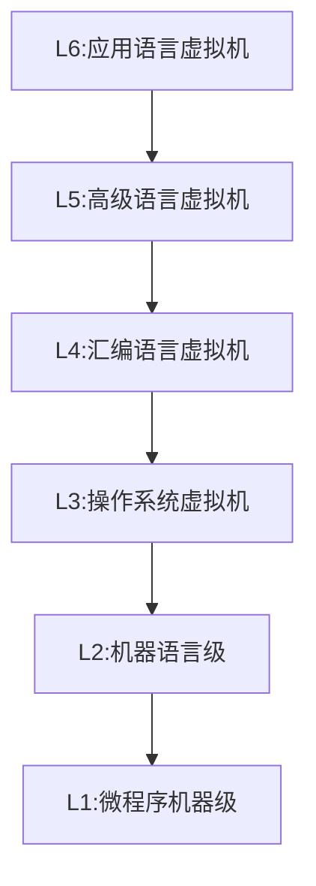

# 第一章 计算机系统结构的基本概念

## 体系结构概述

- A: Acceleration, Amdahl; 快！
- I: Instruction, Interface；指令系统：CISC / RISC
- P: Processing, Parallel；并行处理
- S: Storage，存储器
- N: Network，互连网络

## 计算机系统结构的定义

计算机系统结构是机器语言级程序员所看到的计算机属性。

- 指令系统
- 数据表示
- 寻址规则
- 寄存器定义
- 中断系统
- 机器工作状态的定义和切换
- 存储系统
- 信息保护
- I/O结构

## Flynn分类法

Flynn分类法是按照指令流和数据流的多重性对计算机系统结构的分类方法，定义了：

- 指令流(Instruction stream)：即计算机执行的指令序列
- 数据流(Data stream)：即由指令流调用的数据序列
- 多重性 (Multiplicity)：即在系统受限的部件上，同时处于同一执行阶段的指令或数据的最大数目

按照Flynn分类法分为以下4类：

1. 单指令流单数据流SISD
2. 单指令流多数据流SIMD
3. 多指令流单数据流MISD
4. 多指令流多数据流MIMD

MM: Memory Model；SM: Shared Memory.

## 计算机系统设计的定量原理

### 以经常性事件为重点

主要优化经常性发生的事件/流程

### Amdahl定律

加快某部件执行速度所能获得的系统性能加速比，受限于该部件的执行时间占系统中总执行时间的百分比。

- 可改进比例：在改进前的系统中，可改进部分的执行时间在总执行时间中的占比。
- 部件加速比：可改进部分改进以后性能提高的倍数。

$$
加速比S=\frac{总执行时间_{改进前}}{总执行时间_{改进后}}=\frac{1}{1-可改进比例+\frac{可改进比例}{部件加速比}}
\\
加速比S=\frac{1}{（1-\sum各部件可改进比例）+\sum\frac{各部件可改进比例}{各部件加速比}}
$$

### CPU性能公式

执行一个程序所需的CPU时间：
$$
CPU时间=执行程序所需的总周期数/所执行的指令条数
$$
平均指令周期数CPI（cycles per instruction）：
$$
CPU时间=IC\times CPI\times 时钟周期时间
$$
IC为指令条数。

### 程序的局部性原理

是指程序执行时所访问的存储器地址不是随机分布的，是相对簇聚的。局部性包括**时间局部性**和**空间局部性**。

时间局部性：程序即将用到的信息很可能是目前正在使用的信息。

空间局部性：程序即将用到的信息很可能与正在使用的信息在空间上相邻或相近。

## 性能测评

### 执行时间和吞吐量

执行时间：单个程序执行所花费的时间，只关心单个程序的执行时间快慢。

吞吐量：单位时间内完成任务数量的多少，关心多个任务的完成快慢。

## 软件的对系统结构的影响

可移植性是指软件不修改或者少量修改就可以移植到另一台计算机上运行，这种情况下称这两台计算机是兼容的。实践可移植性的形式有：**系列机**、**模拟与仿真**、**统一高级语言**。

### 系列机

具有相同及系统结构，但具有不用组成和实现的一系列不同型号的计算机。向后兼容是系列机的基本特征。

### 模拟与仿真

在一种系统结构上实现另一种系统结构；在一种计算机上实现另一种计算机的指令集。

模拟：使用软件的方法在现有计算机（宿主机）上实现另一种计算机（虚拟机）的指令集，虚拟机的每一条指令都由宿主机的一段程序实现。

仿真：用现有计算机（宿主机）上的微程序去解释实现另一种计算机（目标机）的指令集。

仿真的速度通常比模拟更快，一般结合使用。

## 并行性的发展

### 并行性的概念

同一时刻或同一时间间隔内进行多种运算或操作，包括同时性和并发性。

同时性：两个或及以上的事件在同一时刻发生。

并发性：两个或及以上的时间在同一时间间隔内发生。

### 提高并行性的技术途径

1. 时间重叠：引入时间因素，让多个任务才时间上错开，轮流重叠地使用同一套硬件设备的各个部分
2. 资源重复：引入空间因素，重复设置硬件资源
3. 资源共享：软件方法，多个任务按时间顺序轮流使用同一套硬件设备。

# 第二章 计算机指令集结构

## 指令集结构的分类

区别不同指令集结构的主要因素是CPU中用来存储操作数的存储单元的类型，主要有堆栈、累加器和通用寄存器。在通用寄存器中根据操作数来源不同又可分为寄存器-存储器结构（RM结构）和寄存器-寄存器结构（RR结构）。RR结构也称load-store结构。

特点：

- 堆栈结构：两个操作数都是隐式的，运算放回堆栈
- 累加器结构：操作数一个是隐式的，一个是显式的，运算结果放回累加器
- 寄存器结构：两个操作数都是显示的，一个来源于寄存器，另一个来源于寄存器或存储器。

堆栈结构和累加器结构的指令字都比较短，但不够灵活。

## 寻址方式

是指一种指令集结构如何确定要访问的数据的地址。

Mips常见的寻址方式有：寄存器寻址、立即数寻址、偏移寻址、寄存器间接寻址、直接寻址或绝对寻址

偏移量寻址需要确定偏移量的范围以便确定指令中用多少位字段表示偏移量，影响指令字长。一般来说偏移量大小比较多，并且较小和较大的占比偏多。

立即数寻址也需要确定范围并且同样影响指令字长。一般来说至少设置为8～16位。

## 指令集功能设计

CISC（复杂指令集计算机）的问题日益凸显：

1. 指令的使用频度相差悬殊
2. 指令集庞大，条数多，功能复杂，占用芯片面积大
3. 某些指令操作繁杂，CPI较大，执行速度慢
4. 指令功能复杂，规整性不好，难以使用流水线技术

于是提出了RISC（精简指令集计算机）的设计思想。

RISC设计原则如下：

1. 指令条数少而简单
2. 采用简单而又统一的指令格式
3. 指令的执行在单个机器周期内完成
4. 只有load-store指令才能访问存储器
5. 指令大多采用硬连逻辑实现
6. 强调优化编译器的作用
7. 充分利用流水线技术

- 指令周期：CPU从存储器中**取出并执行一条指令所需的全部时间**称之为指令周期。
- 机器周期：也称为**CPU周期**。在计算机中，为了便于管理，常把一条指令的执行过程划分为若干个阶段（如取指、译码、执行等），每一阶段完成一个基本操作。**完成一个基本操作所需要的时间称为机器周期**。一般情况下，一个**机器周期由若干个时钟周期**组成 。
- 时钟周期：定义为主频的倒数，有时也称之为**节拍（pulse）**
-  指令周期由若干个机器周期组成，而机器周期又包含若干个时钟周期，基本总线周期由4个时钟周期组成

## 控制指令

控制指令是用来改变控制流的，当指令是无条件改变控制流时称为跳转指令，，有条件改变控制流时称之为分支指令。

可以改变控制流的有四种：条件分支、跳转、过程调用和过程返回。

绝大部分改变控制流的指令都是条件分支。

## 数据表示

是指计算机硬件能够直接识别，指令集可以直接调用的数据类型，比如定点数（整型）、逻辑数（布尔型）、浮点数（实型）等

数据结构是有软件进行处理和实现的各种数据类型，研究的是逻辑结构和物理结构的关系。

操作数类型的表示方式有：

- 由操作码指定操作数类型
- 给数据较上标识，有数据本身给出类型

操作数大小一般分为字节（8位）、半字（16位）、字（32位）、双字（64位）

## 指令格式设计

指令有两部分组成：操作码和操作数，指令格式设计就是确定指令字的编码方式，包括操作码字段和地址码字段的编码和表示方式。寻址方式的表示方法有两种，一种是与操作码一起编码，另一种是设置专门的描述符。

指令集的编码方式有以下三种：

- 可变长度编码格式：适合指令集的寻址方式和操作种类很多，但是会导致字长和执行时间相差很大。
- 固定长度编码格式：将操作类型和寻址方式一起编码到操作码中，适合寻址方式和操作类型非常少的情况，所有指令长度固定统一，降低译码复杂度。
- 混合行编码格式：提供若干种固定的指令字长，以期达到既能减少木雕代码长度又能降低译码复杂度的目标。

## Mips指令集结构

### Mips的寄存器

有32个64位通用寄存器，R0的值永远是0；还有32个64为浮点寄存器，可以存放单精度或双精度浮点数。

### Mips寻址方式

只有立即数寻址和偏移量寻址两种，都是16位的。

按字节寻址，地址64位。

### Mips指令格式

指令字长32位。

- I类指令：包括load和store指令、立即数指令、分支指令、寄存器跳转指令、和寄存器链接跳转指令立即数字段为16位，用于提供立即数或偏移量。格式为【操作码】【源寄存器1】【源寄存器2】【立即数】
- R类指令：包括ALU指令、专用寄存器读/写指令、move指令等。格式为【操作码】【源寄存器1】【源寄存器2】【 目的寄存器】【 shamt（置为0）】【 运算码】
- J类指令：包括跳转指令、链接跳转指令、自陷指令与异常返回指令。格式为【操作码】【 偏移量】,偏移量占低26位。

### Mips的操作指令

Mpis的指令可以分为4类：load和store指令、ALU操作指令、分支与跳转指令、浮点操作指令。

### Mips的控制指令

Mips的控制流由一组跳转指令和一组分支指令来实现。

# 第三章 流水线技术

## 流水线的基本概念

把多个处理过程在时间上错开，依次通过个功能段，这样每个子过程就可以与其他子过程并行，这就是流水线技术。

流水线的段数称为流水线的深度。

流水线的工作过程通常采用时空图的方法来描述。横坐标表示时间，当流水线中各段时间相等时，横坐标经常以各段的时间作为刻度单位；纵坐标表示空间，即流水线中的每一个流水段。

## 流水线的分类

### 单功能与多功能

- 单功能流水线：只能完成一种功能的流水线，如浮点加法流水线
- 多功能流水线：流水线的各段可以进行不同的连接以完成不同的功能

### 静态与动态

- 静态流水线：在同一时间内，多功能流水线各段只能按照同一种功能的连接方式工作；要按照另一种连接实现其他功能时，必须等待原来连接方式处理的所有任务都流出流水线之后才能改变连接。

  

- 动态流水线：在同一时间内，多功能流水线的各段可以按照不同的方式连接，同时执行多种功能。

  

### 部件级、处理机级、处理机间

- 部件级流水线（运算流水线）：把处理机的算术逻辑运算部件分段，使得各种类型的运算能够按照流水线方式进行。

  

- 处理机级流水线（指令流水线）：把指令的解释执行过程按照流水线的方式处理。

  

- 处理机间流水线（宏流水线）：两个或及以上的处理机串行连接起来，对同一数据流进行处理，每个处理机完成整个任务中的一部分。

  

### 线性与非线性

这是按照流水线中是否有反馈回路来分的。

- 线性流水线：流水线各段串行连接，没有反馈回路，每段最多只流过一次。

- 非线性流水线：流水线中除了有串行的连接外，还有反馈回路，某些段数据要多次通过。

  

### 按序和乱序

- 按序流水线：输出端任务流出顺序与输入端任务流入顺序一致。
- 乱序流水线：输出端任务流出顺序与输入端任务流入顺序可以不同。

## 流水线的性能指标

### 吞吐量

是指单位之间内完成得到任务数量，基本计算公式：
$$
TP = \frac{n}{T_k}
$$
n是任务数量，k是流水线段数，$T_k$是处理n个任务的时间。

#### 各段时间均等的流水线

n个任务连续输入是，第一个任务在k个单位时间后流出，之后每个单位时间流出一个任务。

流水线完成n个连续任务所需的总时间为：
$$
T_k=k\Delta t+(n-1)\Delta t=(k+n-1)\Delta t
$$
带入基本计算公式得实际吞吐量为：
$$
TP=\frac{n}{(k+n-1)\Delta t}
$$
最大吞吐量为：
$$
TP_{max}=\lim_{n\rightarrow \infty}\frac{n}{(k+n-1)\Delta t}=\frac{1}{\Delta t}
$$
当n>>k时，各段时间相等流水线的吞吐量约为每单位时间1个任务。

#### 各段时间不等的流水线

流水线中时间最长的段称为瓶颈段。

实际吞吐量为：
$$
TP=\frac{n}{\sum_{i=1}^{k}\Delta t+(n-1)max(\Delta t_1,\Delta t_2,...,\Delta t_k)}
$$
最大吞吐量为：
$$
TP_{max}=\frac{1}{max(\Delta t_1,\Delta t_2,...,\Delta t_k)}
$$
在各段不等流水线中，流水线的实际吞吐量和最大吞吐量有时间最长的段决定。

#### 解决瓶颈段的方法

1. 细分瓶颈段：将瓶颈段拆分为多个单位时间长的段，使得每隔一个单位时间流出一个任务。
2. 重复设置瓶颈段：按照瓶颈段与单位时间的倍数为数量重复设置多个瓶颈段，依次错开处理任务，使得每隔一个单位时间流出一个任务。

### 加速比

是指不使用流水线所用时间与使用流水线所用时间之比。不使用流水线所用时间$T_s$，使用流水线所用时间$ T_k$。

加速比为：
$$
S=\frac{T_s}{T_k}=\frac{nk}{k+n-1}
$$

### 效率

是指流水线中设备实际使用时间和整个运行时间的比值。

各段时间均等流水线的各段效率$e_i$相同：
$$
e_1=e_2=...=e_k=\frac{n\Delta t }{T_k}=\frac{n}{k+n-1}
$$
整条流水线效率：
$$
E=\frac{e_1+e_2+...+e_k}{k}=\frac{ke_1}{k}=\frac{kn\Delta t}{kT_k}=\frac{n}{k+n-1}
$$
n>>k时流水线效率接近为1。

可借助时空图计算效率：
$$
E=\frac{n个任务实际占用的时空区}{k个段总的时空区}
$$

## 流水线的相关与冲突

### 经典5段流水线

1. 取指令（IF）周期：从存储器中取出指令并放入指令寄存器IR；PC值加4,指向下一条指令。
2. 指令译码/读寄存器（ID）周期：译码操作与读寄存器操作是并行进行的。
3. 执行/有效地址计算（EX）周期：进行计算和判断分支（BEQZ等于0时分支）结果
4. 存储器访问/分支完成（MEM）周期
5. 写回（WB）周期

为了避免IF段的访存取指令与MEM段的访存读写数据冲突，一般采用分离的指令Cache和数据Cache方法。

为了避免ID段的读寄存器和WB的写寄存器冲突，一般采用时钟周期前半拍写后半拍读的方法。

### 相关

是指两条指令之间存在某种依赖关系。

1. 数据相关/写后读：数据相关具有传递性。由于数据流动造成。
2. 名相关：名指的是寄存器或存储器的名称。没有数据流动，可通过换名技术消除。
   - 反相关：读后写
   - 输出相关：写后写
3. 控制相关：保证程序应有的执行顺序。

### 冲突

1. 结构冲突：由于部件不是完全流水或者资源份数不够，通过停顿一个时钟周期解决，该停顿周期被称为流水线气泡。
2. 数据冲突：指令执行时需要其他指令的计算结果。通过定向技术解决：指令计算产生结果前，其他指令并不立即需要该结果，从产生结果的地方（EX/MEM寄存器）直接送到需要的地方（ALU入口）即可。
   - 写后读：真数据相关
   - 写后写：输出相关
   - 读后写：反相关
3. 控制冲突：可能造成更多的性能损失，通过尽早预测分支结果和计算分支后的跳转地址优化。

# 第五章 存储系统

## 多级层次结构

越靠近CPU的层级速度越快、容量越小、价格越贵，越远离CPU的层级速度越慢、容量越大、价格越便宜。

存储系统要达到的目标是：从CPU来看，存储系统的速度接近于M1,容量和每位价格接近于Mn

## 性能参数

出于方便只考虑两级存储层次M1与M2。

### 命中率与失效率

定义为：CPU访问时在M1中找到信息的概率。计算公式为：
$$
H=\frac{N_1}{N_1+N_2}
$$
$N_1、N_2$分别是访问M1、M2的次数。

失效率指访问M1时找不到的概率，计算公式为：
$$
F=1-H
$$

### 平均访存时间

在M1中找到所需信息称为命中，**命中时间**即为访问M1时间。

失效时，需要在M2中找到并将信息发送至M1,所以失效开销为：
$$
T_m=T_2+T_B
$$
$T_2、T_B$分别为访问M2的时间和传送到M1的时间。

平均访存时间是结合命中开销、命中率、失效开销、失效率得到的，计算公式为：
$$
T_A=HT_1+(1-H)T_M=T_1+(1-H)T_M\\
T_A=T_1+FT_M
$$

## Cache基本知识

### 映像规则

1. 全相连：主存的任意块映射到Cache的任意位置。
2. 直接相连：主存中的每一块只能映射到Cache的一个位置。
3. 组相连：主存中的块可以映射到Cache唯一一组中的任意位置。

每组中有n块，称为n路组相连。n=1时，相当于直接相连；组数=1时，相当于全相连。

### 查找方法

Cache中维护一个目录表，每个Cache块在表中都有唯一一项，记录了块的主存地址的高位部分，称之为标号/页框号。这个目录表又称为标识存储器。为了提高访问速度，主存/Cache的地址转换和访问Cache同时进行。把Cache中候选位置的标识都读取出来再跟访问信息比较，得出一个结果发送给CPU。

使用相连存储器查找：先选出该地址块所在的组，依次比较标识存储器中存放的标识，一致且有效位为1,则读取组内块地址对应的Cache块给CPU。

使用单体多字的按地址访问存储器和比较器：选择一组，同时读取组中各项存储的标识与所查找信息比较，返回成功的地址。一行索引对应一个cache组，图中1-4组h位对应cache组中各项存储的标识。

### 写策略

1. 写直达法：不仅写入cache,也写入下一级存储器。易于实现，数据一致性好，使用写缓冲器减少CPU的写停顿。
2. 写回法：只写入cache,等待被替换时再写入下级存储器。速度快，对下级存储带宽要求低。

### Cache性能分析

性能衡量指标：
$$
CPU时间=（CPU执行周期数+存储器停顿周期数）\times 时钟周期时间
$$
提取公因子指令数IC
$$
\begin{align}
CPU时间&=IC\times（CPI_{执行}+\frac{访存次数}{指令数}\times 不命中率 \times 不命中开销）\times 时钟周期时间\\
&=IC\times （CPI_{执行}+每条指令平均n访存次数\times 不命中率\times 不命中开销）\times 时钟周期时间
\end{align}
$$

### 三种不命中

1. 强制性不命中：第一次访问块，不在Cache内，必须从下级存储器中调取。可以增加块大小/预取。
2. 容量不命中：Cache容量不足，不断有块被替换进Cache。可以增加容量
3. 冲突不命中：组相连或直接相连中，映射到同一组/块的被不断访问造成不断被替换进入Cache.可以提高相连度。

### 解决不命中的方法

1. 增加Cache块大小：增强空间局部性，减少了强制性不命中；减少了Cache中块的数目，所以可能增加冲突不命中；增加了不命中开销
2. 增加Cache块容量：一般用于片外Cache
3. 提高相连度：一般相连度小于8；2:1Cache经验规则：容量为N的直接映像Cache与容量为N/2的两路组相连Cache不命中率差不多
4. 伪相连Cache：将Cache分为两部分， 第一部分作为正常Cache访问，当失效时将地址最高位取反访问第二部分，命中称之为伪命中，否则访问下级存储。
5. 牺牲Cache：额外设置一个全相连的小Cache存放从主Cache替换出来的块，以备重用

### 减少失效开销的方法

1. 两级Cache
2. 读不命中优先于写：读不命中时先检查写缓冲器中有无，在访问下级存储器
3. 写缓冲合并：写入写缓冲器时检查是否有可合并的地址

### 减少命中时间

1. 容量小、结构简单的Cache：硬件越简单越快
2. 虚拟Cache：使用虚拟地址访问Cache

## 并行主存系统

### 多体交叉存储器

1. 高位交叉编址：按列优先

   

   存储单元线性地址A、存储单元体号j、体内地址i、共m个存储体、n个体内地址；
   $$
   A=j\times n+j\\
   j=\left\lfloor \frac{A}{n}\right\rfloor,i=A \bmod n 
   $$
   

2. 低位交叉编址：按行优先

   
   $$
   A=i\times m +j\\
   i=\left \lfloor \frac{A}{m} \right\rfloor,j=A \bmod m
   $$
   主要采用低位交叉编址，因为在连续访问存储器时可以同时访问多个存储体而提高带宽。

### 避免存储体冲突

通过将存储体数设置为素数且为$ 2^n-1$，体内地址可以简单计算为：
$$
i=A \bmod n
$$
可以大大减少冲突。

# 第七章 互连网络

## 互连函数

定义：反应网络输入端数组和输出端数组之间对应的置换关系或排列关系，所以互连函数也称之为置换函数或者排列函数。

互连网络具有三大要素，即结点间互连结构、开关元件和控制方式。

## 基本互连函数

### 恒等函数

输入端与输出端同号连接
$$
I(x_{n-1}x_{n-2}\cdots x_1x_0)=x_{n-1}x_{n-2}\cdots x_1x_0
$$

### 交换函数

第k位取反
$$
E(x_{n-1}x_{n-2}\cdots x_k\cdots x_1x_0)=x_{n-1}x_{n-2}\cdots \overline{x}_k\cdots x_1x_0
$$
主要用于构建立方体和超立方体网络
$$
Cube_0(x_2x_1x_0)=x_2x_1\overline{x}_0\\
Cube_1(x_2x_1x_0)=x_2\overline{x}_1x_0\\
Cube_2(x_2x_1x_0)=\overline{x}_2x_1x_0\\
$$

### 均匀洗牌函数

二进制编号循环左移一位
$$
\sigma=(x_{n-1}x_{n-2}\cdots x_1x_0)=x_{n-2}x_{n-3}\cdots x_1x_0x_{n-1}
$$
第k个子函数：二进制编号中的低k位循环左移一位
$$
\sigma_{(k)}(x_{n-1} \cdots x_k \mid x_{k-1} x_{k-2} \cdots x_0) = x_{n-1} \cdots x_k \mid x_{k-2} \cdots x_0 x_{k-1}
$$
第k个超函数：二进制编号中的高k位循环左移一位
$$
\sigma^{(k)}(x_{n-1} \cdots x_k \mid x_{k-1} x_{k-2} \cdots x_0) = x_{n-2} \cdots x_{n-k} x_{n-1} \mid x_{n-k-1} \cdots x_1x_0 
$$

### 蝶式函数

二进制编号最高位与最低位互换

### 移数函数

加减k位后取模

### PM2I函数

加减$2^i$位后取模

## 静态互连网络特性

### 线性阵列

与总线形不同，总线型每次只允许一对节点使用，线性可以允许多对节点并行使用其中的不同部分

### 环和带弦环

可以单向可以双向

### 循环移数

比环和带弦环连接性好，但是比全连接网络低得多

### 树形和星形

可扩展结构，但是直径较长

星形直径较短但可靠性差

### 网格形和环网形

可以向高维扩展

### 超立方体

节点度随维度线性增加，扩展困难

## 开关模块

### $2\times 2$开关的连接方式

### 3种控制方式

1. 级控制：每一级的所有开关都只用一个控制信号控制，这些开关智能同时处于同一种状态
2. 单元控制：每一个开关都已一个独立的控制信号，可以各自处于不同的状态
3. 部分级控制：第i级的所有开关分别用i+1个信号控制，$ 0\le i\le n-1$,n为级数。

## 动态互连网络

### 总线网络

每次只能用于一个源到一个或多个目的之间的数据传送。结构简单、实现成本低，但是许多模块分时共享，每次只能处理一个请求，容易成为瓶颈。

### 交叉开关网络

可以看作一个单级开关网络，能在对偶（源、目的）之间形成动态连接，同时实现多个对之间的无阻塞连接。

每一行和每一列只能接通一个交叉点开关。

### 多级互连网络

每一及都用了多个$a \times b$开关，相邻各级开关之间都有固定的级连接。

# 第八章 多处理机

## 按照存储器结构的多处理机分类

### 集中式共享存储型体系结构多处理机

处理器数量较少，各处理器可共享一个集中式物理存储器，又称对称式多处理机。各处理器访问存储器所花时间相同。

### 分布式存储多处理机

支持规模较大的多处理机系统，要求有高带宽的互连网络。

- 如果大多数访存都是针对本地存储器的，则可以降低对存储器和互连网络的带宽要求
- 对本地存储器访问延迟很小。

### 存储器系统结构和通讯机制

#### 编址方案

1. 所有存储器用统一的共享逻辑空间进行编制，这样可以访问任意一个大暖，不同处理器上的同一个物理地址指向的是同一个存储单元。这类计算机系统被称为分布式共享存储器系统。
2. 不同节点中的地址空间是相互独立的，每个节点中的存储器只能有本地处理器访问，远程处理器不能对其直接访问。

#### 通信机制

1. 共享地址空间的计算机系统：采用共享存储器通信机制，使用load和store指令对相同存储器地址进行读写操作。
2. 独立地址空间的计算机系统：数据通信要通过在处理器之间显式的传递消息来完成，成为消息传递通信机制。

## 多处理机Cache一致性

如果允许共享数据进入Cache,那么就可能出现多个处理器的Cache中都有同一存储块的副本，当其中某个处理器对Cache中的数据进行修改后，就会使得该Cache中的数据与其他Cache中的数据不一致。

## Cache一致性

要跟踪共享数据块的状态。

### 一致性协议

- 目录协议：共享状态被保存在一个称之为目录的地方，实现开销比监听协议稍微大一点，但可用于更大规模的多处理机。
- 监听协议：共享状态信息与数据块一起放在Cache中，没有集中的状态表。所有的访存请求都发布在总线上，其他Cache监听总线是否有请求的数据块，如果有就进行享用操作。

### 实现一致性的方法

- 写作废协议：处理器在写入之间，把其他所有Cahe中的副本全都作废，保证了唯一访问权。
- 写更新协议：处理器在写入时，把新数据广播给其他所有Cache，其他Cache如果有副本就更新。

## 对称式多处理机

采用监听+写作废

## 分布式多处理机

采用目录+写作废

