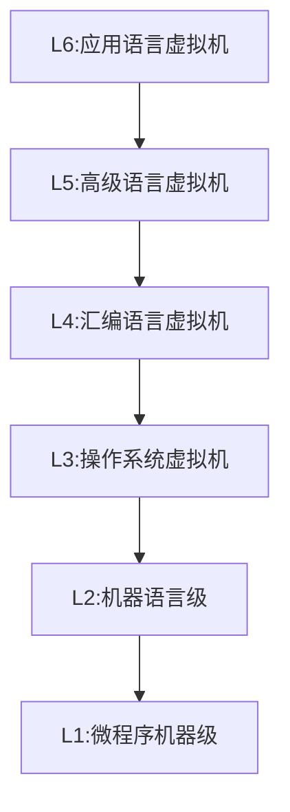

## 第一章 计算机系统结构的基本概念

### 体系结构概述

- A: Acceleration, Amdahl; 快！
- I: Instruction, Interface；指令系统：CISC / RISC
- P: Processing, Parallel；并行处理
- S: Storage，存储器
- N: Network，互连网络

### 计算机系统结构的定义

计算机系统结构是机器语言级程序员所看到的计算机属性。

- 指令系统
- 数据表示
- 寻址规则
- 寄存器定义
- 中断系统
- 机器工作状态的定义和切换
- 存储系统
- 信息保护
- I/O结构

### Flynn分类法

Flynn分类法是按照指令流和数据流的多重性对计算机系统结构的分类方法，定义了：

- 指令流(Instruction stream)：即计算机执行的指令序列
- 数据流(Data stream)：即由指令流调用的数据序列
- 多重性 (Multiplicity)：即在系统受限的部件上，同时处于同一执行阶段的指令或数据的最大数目

按照Flynn分类法分为以下4类：

1. 单指令流单数据流SISD
2. 单指令流多数据流SIMD
3. 多指令流单数据流MISD
4. 多指令流多数据流MIMD

MM: Memory Model；SM: Shared Memory.

### 计算机系统设计的定量原理

#### 以经常性事件为重点

主要优化经常性发生的事件/流程

#### Amdahl定律

加快某部件执行速度所能获得的系统性能加速比，受限于该部件的执行时间占系统中总执行时间的百分比。

- 可改进比例：在改进前的系统中，可改进部分的执行时间在总执行时间中的占比。
- 部件加速比：可改进部分改进以后性能提高的倍数。

$$
加速比S=\frac{总执行时间_{改进前}}{总执行时间_{改进后}}=\frac{1}{1-可改进比例+\frac{可改进比例}{部件加速比}}
\\
加速比S=\frac{1}{（1-\sum各部件可改进比例）+\sum\frac{各部件可改进比例}{各部件加速比}}
$$

#### CPU性能公式

执行一个程序所需的CPU时间：
$$
CPU时间=执行程序所需的总周期数/所执行的指令条数
$$
平均指令周期数CPI（cycles per instruction）：
$$
CPU时间=IC\times CPI\times 时钟周期时间
$$
IC为指令条数。

#### 程序的局部性原理

是指程序执行时所访问的存储器地址不是随机分布的，是相对簇聚的。局部性包括**时间局部性**和**空间局部性**。

时间局部性：程序即将用到的信息很可能是目前正在使用的信息。

空间局部性：程序即将用到的信息很可能与正在使用的信息在空间上相邻或相近。

### 性能测评

#### 执行时间和吞吐量

执行时间：单个程序执行所花费的时间，只关心单个程序的执行时间快慢。

吞吐量：单位时间内完成任务数量的多少，关心多个任务的完成快慢。

### 软件的对系统结构的影响

可移植性是指软件不修改或者少量修改就可以移植到另一台计算机上运行，这种情况下称这两台计算机是兼容的。实践可移植性的形式有：**系列机**、**模拟与仿真**、**统一高级语言**。

#### 系列机

具有相同及系统结构，但具有不用组成和实现的一系列不同型号的计算机。向后兼容是系列机的基本特征。

#### 模拟与仿真

在一种系统结构上实现另一种系统结构；在一种计算机上实现另一种计算机的指令集。

模拟：使用软件的方法在现有计算机（宿主机）上实现另一种计算机（虚拟机）的指令集，虚拟机的每一条指令都由宿主机的一段程序实现。

仿真：用现有计算机（宿主机）上的微程序去解释实现另一种计算机（目标机）的指令集。

仿真的速度通常比模拟更快，一般结合使用。

## 并行性的发展

#### 并行性的概念

同一时刻或同一时间间隔内进行多种运算或操作，包括同时性和并发性。

同时性：两个或及以上的事件在同一时刻发生。

并发性：两个或及以上的时间在同一时间间隔内发生。

#### 提高并行性的技术途径

1. 时间重叠：引入时间因素，让多个任务才时间上错开，轮流重叠地使用同一套硬件设备的各个部分
2. 资源重复：引入空间因素，重复设置硬件资源
3. 资源共享：软件方法，多个任务按时间顺序轮流使用同一套硬件设备。

## 第二章 计算机指令集结构

### 指令集结构的分类

区别不同指令集结构的主要因素是CPU中用来存储操作数的存储单元的类型，主要有堆栈、累加器和通用寄存器。在通用寄存器中根据操作数来源不同又可分为寄存器-存储器结构（RM结构）和寄存器-寄存器结构（RR结构）。RR结构也称load-store结构。

特点：

- 堆栈结构：两个操作数都是隐式的，运算放回堆栈
- 累加器结构：操作数一个是隐式的，一个是显式的，运算结果放回累加器
- 寄存器结构：两个操作数都是显示的，一个来源于寄存器，另一个来源于寄存器或存储器。

堆栈结构和累加器结构的指令字都比较短，但不够灵活。

### 寻址方式

是指一种指令集结构如何确定要访问的数据的地址。

Mips常见的寻址方式有：寄存器寻址、立即数寻址、偏移寻址、寄存器间接寻址、直接寻址或绝对寻址

偏移量寻址需要确定偏移量的范围以便确定指令中用多少位字段表示偏移量，影响指令字长。一般来说偏移量大小比较多，并且较小和较大的占比偏多。

立即数寻址也需要确定范围并且同样影响指令字长。一般来说至少设置为8～16位。

### 指令集功能设计

CISC（复杂指令集计算机）的问题日益凸显：

1. 指令的使用频度相差悬殊
2. 指令集庞大，条数多，功能复杂，占用芯片面积大
3. 某些指令操作繁杂，CPI较大，执行速度慢
4. 指令功能复杂，规整性不好，难以使用流水线技术

于是提出了RISC（精简指令集计算机）的设计思想。

RISC设计原则如下：

1. 指令条数少而简单
2. 采用简单而又统一的指令格式
3. 指令的执行在单个机器周期内完成
4. 只有load-store指令才能访问存储器
5. 指令大多采用硬连逻辑实现
6. 强调优化编译器的作用
7. 充分利用流水线技术

- 指令周期：CPU从存储器中**取出并执行一条指令所需的全部时间**称之为指令周期。
- 机器周期：也称为**CPU周期**。在计算机中，为了便于管理，常把一条指令的执行过程划分为若干个阶段（如取指、译码、执行等），每一阶段完成一个基本操作。**完成一个基本操作所需要的时间称为机器周期**。一般情况下，一个**机器周期由若干个时钟周期**组成 。
- 时钟周期：定义为主频的倒数，有时也称之为**节拍（pulse）**
-  指令周期由若干个机器周期组成，而机器周期又包含若干个时钟周期，基本总线周期由4个时钟周期组成

### 控制指令

控制指令是用来改变控制流的，当指令是无条件改变控制流时称为跳转指令，，有条件改变控制流时称之为分支指令。

可以改变控制流的有四种：条件分支、跳转、过程调用和过程返回。

绝大部分改变控制流的指令都是条件分支。

### 数据表示

是指计算机硬件能够直接识别，指令集可以直接调用的数据类型，比如定点数（整型）、逻辑数（布尔型）、浮点数（实型）等

数据结构是有软件进行处理和实现的各种数据类型，研究的是逻辑结构和物理结构的关系。

操作数类型的表示方式有：

- 由操作码指定操作数类型
- 给数据较上标识，有数据本身给出类型

操作数大小一般分为字节（8位）、半字（16位）、字（32位）、双字（64位）

### 指令格式设计

指令有两部分组成：操作码和操作数，指令格式设计就是确定指令字的编码方式，包括操作码字段和地址码字段的编码和表示方式。寻址方式的表示方法有两种，一种是与操作码一起编码，另一种是设置专门的描述符。

指令集的编码方式有以下三种：

- 可变长度编码格式：适合指令集的寻址方式和操作种类很多，但是会导致字长和执行时间相差很大。
- 固定长度编码格式：将操作类型和寻址方式一起编码到操作码中，适合寻址方式和操作类型非常少的情况，所有指令长度固定统一，降低译码复杂度。
- 混合行编码格式：提供若干种固定的指令字长，以期达到既能减少木雕代码长度又能降低译码复杂度的目标。

### Mips指令集结构

#### Mips的寄存器

有32个64位通用寄存器，R0的值永远是0；还有32个64为浮点寄存器，可以存放单精度或双精度浮点数。

#### Mips寻址方式

只有立即数寻址和偏移量寻址两种，都是16位的。

按字节寻址，地址64位。

#### Mips指令格式

指令字长32位。

- I类指令：包括load和store指令、立即数指令、分支指令、寄存器跳转指令、和寄存器链接跳转指令立即数字段为16位，用于提供立即数或偏移量。格式为【操作码】【源寄存器1】【源寄存器2】【立即数】
- R类指令：包括ALU指令、专用寄存器读/写指令、move指令等。格式为【操作码】【源寄存器1】【源寄存器2】【 目的寄存器】【 shamt（置为0）】【 运算码】
- J类指令：包括跳转指令、链接跳转指令、自陷指令与异常返回指令。格式为【操作码】【 偏移量】,偏移量占低26位。

#### Mips的操作

Mpis的指令可以分为4类：load和store指令、ALU操作指令、分支与跳转指令、浮点操作指令。

#### Mips的控制指令

Mips的控制流由一组跳转指令和一组分支指令来实现。

# 第三章 流水线技术

# 第五章 存储系统

# 第七章 互连网络

# 第八章 多处理机

