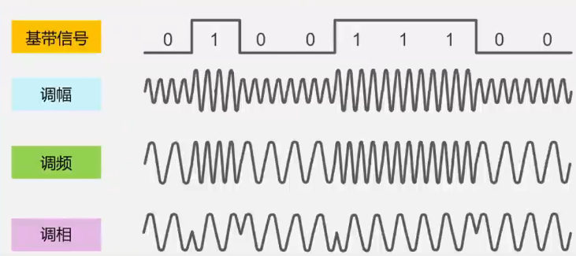

# 计算机网络工程/软考网工-笔记-物理层

参考教材：谢希仁-计算机网络、自顶向下

## 计算机网络结构

**计算机一切皆 0、1**：计算机内部数据的存储运算、通信均采用二进制

### 网络协议

网络协议(Network Protocol)，是为进行网络中的数据交换而建立的规则、标准或约定。

- 语法：数据与控制信息的结构或格式
- 语义：控制信息的具体含义
- 同步（或时序）：时间实现顺序、何时、何种速率

### 协议分层模型

分层：将庞大复杂的问题转化为局部问题，以便于研究与处理。

#### 层次结构的好处

- 各层独立，各司其职
- 灵活性好
- 分割结构
- 易于实现和维护
- 有利于功能复用
- 促进标准化工作 

#### OSI 的体系结构

OSI/RM(Open System Internet/Reference Model)：开发系统互联参考模型，由国际标准化组织 ISO 提出。

| 层数 |       名称       |
| :--: | :--------------: |
|  7   |      应用层      |
|  6   |      表示层      |
|  5   |      会话层      |
|  4   | 运输层（传输层） |
|  3   |      网络层      |
|  2   |    数据链路层    |
|  1   |      物理层      |

**速记口诀**：物-链-网-传-会-表-应

#### TCP/IP 的体系结构

网络接口层并没有定义具体内容。

| 层数 |       名称       |
| :--: | :--------------: |
| 5-7  |      应用层      |
|  4   | 运输层（传输层） |
|  3   |      网际层      |
| 1-2  |    网络接口层    |

五层原理体系结构（实际运用）

| 层数 |       名称       |
| :--: | :--------------: |
| 5-7  |      应用层      |
|  4   | 运输层（传输层） |
|  3   |      网络层      |
|  2   |    数据链路层    |
|  1   |      物理层      |

各层要解决的问题：

- 应用层：进程级别通讯
- 运/传传输层：通过端口号区分进程，端对端通信
- 网络层：区分主机，点对点通讯
- 数据链路层：链路两端的通讯
- 物理层：最底层的 01 通讯

各层传输单位：

- 应用层：数据/信息/报文
- 运输层：数据段/数据报
- 网络层：数据包/报文分组
- 数据链路层：数据帧
- 物理层：比特流

**封装与解封装**

## 数据通信基础

### 常用术语

数据(data)：承载信息的实体

信号：数据的电气/电磁表现

- 模拟信号：取值是连续的
- 数字信号：取值是离散的

码元：时域波形表示数字信号是，代表不同离散数值的基本波形

### 编码与调制

数字数据-> 数字信号：编码；数字信号-> 数字数据：解码

数字数据-> 模拟信号：调制；模拟信号-> 数字数据：解调

#### 常用编码方式

归零：正脉冲表示 1, 负脉冲表示 0

不归零：高电平表示 1, 低电平表示 0

曼彻斯特编码：每位中心上跳变表示 0, 下跳变表示 1

差分曼彻斯特编码：位开始边界有跳变代表 0, 无跳变代表 1

曼彻斯特编码与差分曼彻斯特编码具有 **自同步能力**：能够容易的分辨出单个周期，不易混淆。

传统以太网（10BASE-T，10 mpbs）采用曼彻斯特编码

令牌环网采用差分曼彻斯特编码

#### 基本调制方法

- 调幅：幅移键控 ASK
- 调频：频移键控 FSK
- 调相：相移键控 PSK

**常见调制方式**：

BPSK：二进制相移键控，2 种状态表示 1 位 bit

QPSK：正交相移键控，4 种状态表示 2 位 bit

QAM：正交幅度调制，调相与调幅组合

- 16-QAM： 16 种状态表示 4 位 bit
- 32-QAM
- 64-QAM
- 256-QAM
- 1024-QAM
- 4096-QAM

#### 信道极限容量

##### 奈氏准则 （奈奎斯特准则）

**理想低通信道的最高码元传输速率 = 2 W 波特，W 是理想低通信道的带宽，单位是赫兹（Hz）。波特/波特率，码元传输速率的单位，即码元/秒。**
$$
码元传输的最高速率 = 2W （码元/秒）
$$
信道的最大数据传输速度 $R_{max}$ 可表达为
$$
R_{max}= 2W\log_2M
$$
M 为码元状态。

$\log_2M$ 表示一个码元承载的信息大小，如 1024-QAM 承载 10 bit 信息。

##### 香农公式

1948 年，香农用信息论推导出带宽受限且有高斯白噪声干扰的信道的 **极限、无差错的** 信息传输速率。

信道的极限传输速率 C 可表达为
$$
C = W\log_2(1+S/N)
$$
W 为信道带宽（Hz）

S 为信道内所传信号平均功率

N 为信道内部的高斯噪声功率
$$
信噪比(dB)= 10\log_{10}(S/N)
$$

#### 传输方式

##### 并行与串行

并行：一次发送 n 个 bit, 需要 n 条传输线路；速度快、距离近、主机内传输

串行：依次发送每个 bit, 需要 1 条传输线路；速度慢、距离远、主机间传输

##### 异步与同步

异步：以字节为独立的传输单位，字节之间传输间隔不固定，只在开始传输单个字节内同步。（短信聊天）

同步：以稳定的比特流形式传输，同时收发。（视频电话）

##### 单工、半双工、全双工

单工：单向通信，只能收或只能发

半双工：双向交替，可以收可以发，但不能同时收发

全双工：双向同时，可以同时收发

## 物理层传输媒体

传输媒体：数据传输系统中在发送其和接收器之间的物理通路。

- 导引型：沿着固体媒体传播（光纤、铜线）
- 非导引型：自由空间（电磁波）

### 导引型

#### 双绞线

- 绞合可减少对相邻导线的电磁干扰
- 线序：568A、568B
  - 568B：白橙-橙-白绿-蓝-白蓝-绿-白棕-棕

- 通常多根双绞线再绞合成双绞线电缆
  - 屏蔽双绞线 STP
  - 无屏蔽双绞线 UTP

**主要参数**

- 回波损耗：信号在传输过程中被反射回来的功率与输入功率的比（dB）
- 衰减：信号传输中有能量转化或者被吸收
- 串扰：不同 n 线对之间由于耦合产生的不需要的信号；传音分为远端串音（FEXT）和近端串音（NEXT），测试仪主要测量（NEXT）
- 衰减串扰比：衰减后信号强度与噪声强度比

#### 光纤

利用光导纤维传递光脉冲 

带包层直径 125 微米

**多模与单模**

| 类型       | 光源               | 传输方式 | 光纤颜色     | 纤芯         | 工作波长       | 传输距离  |
| ---------- | ------------------ | -------- | ------------ | ------------ | -------------- | --------- |
| 单模（SM） | 半导体激光器（LD） | 直射     | 黄色         | 9 微米        | 1310～1550 纳米 | 5～40 千米 |
| 多模（MM） | 发光二极管（LED）  | 反射     | 橙色、水蓝色 | 50 或 62.5 微米 | 850 纳米        | 550 米     |

**优点**

- 通信容量大
- 传输损耗小，中级距离长，适合远距离传输
- 抗雷电和电子干扰性能好
- 无串音干扰
- 保密性好，不易被窃听或截取数据
- 体积小，重量轻

**光纤接口**

- LC：俗称小方，用于机房光模块（设备端）
- SC：俗称大方，用于 GPON/EPON 家庭宽带光猫，单根使用；（设备端）
- FC：螺口圆形，插光配线架（ODF）
- ST：挂口圆形，插光配线架（ODF）

**技术参数**

- 回波损耗：光纤尾端或光路端面上一部分光反射回原来的光路中
- 衰减：光功率的减少，光衰单位为 dB/km
- 色散：光纤传输的 n 输出都安光脉冲变宽
- 波长窗口参数：信号波长窗口范围

#### 同轴电缆

由内导体铜质芯线（单股或多股绞合）、绝缘层、网状编制的外导体屏蔽层、塑料保护层组成。

主要用于早期有线电视网

### 非导引

无需铺设线缆，简单便捷，但易受干扰，保密性差。

短波、超短波、微波、红外线、可见光

#### 远距离无限通信

微波基站接力

卫星通讯：延迟 250～300ms

#### 低轨道卫星通讯系统

卫星高度 2000 公里一下

SpaceX 星链

## 信道复用技术

允许多个用户使用同一个共享信道进行通信，充分利用贷款，节省经济成本。

静态复用：频分复用、时分复用、波分复用（光）、码分复用

动态复用：令牌环、CSMA/CD

### 频分复用 FDM

将一个频段分为多个频带。如收音机、电视

### 时分复用 TDM

将时间划分为等长的 TDM 帧，每个用户占用 TDM 帧中固定序号的时隙。TDM 帧周期性出现

SONET、SDH、数字专线、光网络通讯等技术一般使用 TDM

#### 统计时分复用 STDM

STDM 帧不固定分配时隙，按需动态分配时隙以提升线路利用率。

### 波分复用 WDM

光的频分复用，使用一根光纤同时传输多个光载波信号。

PON 网络单纤双向采用 WDM, 上下行波长不同

EPON 网络：OLT-> ONC: 1490nm ONC-> OLT: 1310nm

> **OLT**（Optical Line Terminal，光线路终端）是位于服务提供商端的核心设备，负责控制和管理整个 PON 网络，向 ONU 发送光信号并接收来自 ONU 的光信号，实现用户与服务提供商之间的通信连接。
>
> **ONC**（Optical Network Controller，光网络控制器）是用于管理和控制光纤网络中各种设备和资源的系统，负责配置和监控 ONU、OLT 等设备，动态分配网络资源，支持网络的高效运行和灵活扩展。

### 码分复用 CDM

每个用户在同样的时间同样的频带使用不同的码型进行通讯。

当 CDM 为多个不同地址的用户所共享时，就称为码分多址 CDMA。

#### CDMA 工作原理

每个站（信道）分配的码片序列：各不相同且必须相互正交。

正交：向量 S 和 T 的 **规格化内积** 等于 0
$$
S \cdot T = \frac{1}{m}\sum_{i = 1}^m S_iT_i = 0
$$
先求积，再求和，最后做平均

软考高级网规例题：

 每个码片序列与收到的码片序列做规格化内积，得 1 或 0 为发送，其他为没发送。

## 数字传输系统

主要用于运营商专线

### 早期数字传输系统（电话网）

电话网传输模拟信号，需要调制

PCM, 基于脉冲的编码调制方法

每帧 125 微秒

#### 北美和日本 T1

T1 共有 24 个话路，每个话路采样脉冲用 7 bit 编码，然后再 加上 1 位信令码元，因此一个话路占用 8 bit。在总体加 1 个比特作为帧同步码，这样每帧共有 193(8 *24+1)bit，每秒有 8 k 个 T1 的帧通过接口，即 8 K* 193 = 1.544 Mbps

#### 欧洲和中国 E1

一个 E1 的帧分为 32 个时隙，一个时隙为 8 个 bit，帧长为 256 个 bit。每秒有 8k 个 E1 的帧通过接口，即 8K*256 = 2.048Mbps。

### 同步光网络 SONET

美国 ANSI 标准，采用时分复用技术

只在同步模式下传输数据

传输开销总数为 9✖️3 = 27 字节

标准 STS-1 帧 9 行，每行 90 字节，125 微妙一帧。

速率 = 8000*90\*9\*8 = 51.84 Mbps

### 同步数字系列 SDH

国际标准 ITU-T, 基于 SONET

可以同步可以异步

传输开销总数为 9✖️9 = 81 字节

STM-1, 单个 SDH 帧 125 微妙，9 行，每行 270 字节

速率 = 8000\*270\*9\*8 = 155.52 Mbps

### SONET 和 SDH 标准意义

- 定义了标准光信号，波长 1310nm 和 1550nm
- 在物理层定义了帧结构
- 使各地区标准得到统一，成为公认的传输网体制

### 新一代数字传输网

#### 光传送网 OTN

Optical transport Network, 光波分复用技术，是 SDH 和 WDM 的结合

#### 分组传送网 PTN

Packet Transport Network，分组交换技术

 

## 互联网介入技术

解决最终用户介入本地ISP“最后一公里”问题。

主要有：电话网拨号接入、数字用户接入DSL、光纤同轴混合网接入HFC、光纤接入FTT、以太网接入和无线接入

### 电话网拨号接入

 简单易行、低成本

通过拨号调制解调器接入

- 最高56Kbps接入速率
- 不能同时上网和打电话

### ADSL技术

非对称数字用户线路

上传慢，下载快

把0～4kHz低频留给电话，高频用于上网

采用离散多音调DMT 调制技术

采用频分复用FDM技术

### 光纤同轴混合网HFC

基于有线电视网CATV网

CATV网最高频450MHz,仅用于电视信号下行传输。

机顶盒：连接电视机，数字信号转模拟信号

电缆调制解调器cable modem

### 光纤接入FTTx

#### 无源光网络PON

无源：不需要电源，分光器 物理分光

用户端：ONU/ONT

局端：OLT

##### 以太网无源光网络EPON

链路层使用以太网协议，兼容好成本低

##### 吉比特无源光网络

现行XGPON

采用封装方法，对各种业务提供服务质量保证，总体性能比EPON好